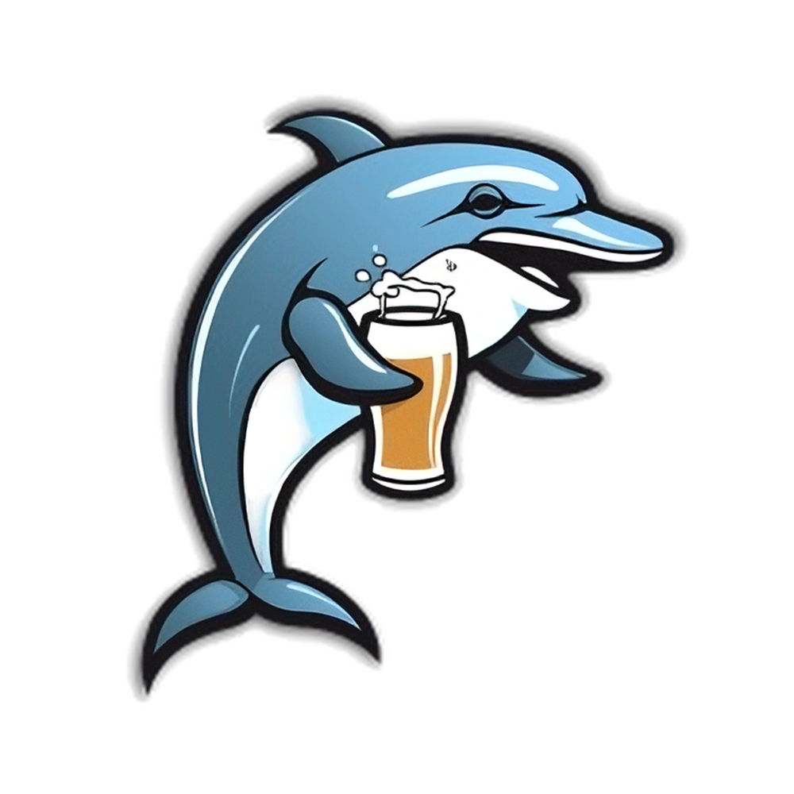

<h1 align="center">
  <br>
  </a>
  <br>
  Drunken Dolphin
  <br>
</h1>

<h4 align="center">My personal CLI assistant, hopefully I can make it a voice assistant.</h4>

<p align="center">
  <a href="">
    
  </a>
  <a href="">
    
  </a>
</p>

<p align="center">
  <strong>🚀 Built with 100% vibe coding using Cursor AI - no traditional development, just pure creative flow and AI collaboration!</strong>
</p>

## Features

- **Fast & Lightweight**: Single binary with zero runtime dependencies
- **Fitness Tracking**: Record push-ups and sit-ups with counts
- **Chore Management**: Add and complete household tasks (coming soon)
- **Flexible Dates**: Track activities for today, yesterday, or specific dates
- **Quick Shortcuts**: Use `today` and `yesterday` commands for both exercises at once
- **Beautiful Output**: Colored output with emojis for better UX
- **Data Persistence**: Automatically saves to JSON file
- **Extensible**: Easy to add new domains (chores, etc.)
- **Cross-platform**: Works on macOS, Linux, and Windows

## Installation

### Prerequisites
- Rust 1.70+ and Cargo

### Option 1: Build from source
```bash
cd drunken-dolphin
cargo build --release
```

The binary will be available at `target/release/drunken-dolphin`

### Option 2: Install globally (Recommended)
```bash
cd drunken-dolphin
cargo install --path .
```

**Important**: After installation, you need to add Cargo's bin directory to your PATH.

#### Adding to PATH

**For Fish Shell:**
```bash
# Add to your Fish config file
echo 'set -gx PATH $HOME/.cargo/bin $PATH' >> ~/.config/fish/config.fish

# Reload your shell
source ~/.config/fish/config.fish
```

**For Zsh/Bash:**
```bash
# Add to your shell profile
echo 'export PATH="$HOME/.cargo/bin:$PATH"' >> ~/.zshrc  # for Zsh
# or
echo 'export PATH="$HOME/.cargo/bin:$PATH"' >> ~/.bash_profile  # for Bash

# Reload your shell
source ~/.zshrc  # for Zsh
# or
source ~/.bash_profile  # for Bash
```

**For macOS (Universal):**
```bash
# Add to your shell profile (works for both Fish and Zsh)
echo 'export PATH="$HOME/.cargo/bin:$PATH"' >> ~/.zshrc
source ~/.zshrc
```

#### Verify Installation
```bash
# Check if the binary is in your PATH
which drunken-dolphin

# Test the command
drunken-dolphin --help
```

**Note**: If you see "fish: Unknown command: drunken-dolphin" or similar, it means the PATH hasn't been updated yet. Reload your shell or restart your terminal after adding to PATH.

### Quick Start
After successful installation and PATH setup:

```bash
# Test the installation
drunken-dolphin --help

# Record your first workout
drunken-dolphin today 20 40

# Check your data file
cat fitness_data.json
```

### Troubleshooting Installation

**Problem**: `fish: Unknown command: drunken-dolphin`
**Solution**: Add Cargo's bin directory to your PATH (see instructions above)

**Problem**: `cargo install` fails
**Solution**: Make sure you're in the project directory and have Rust installed:
```bash
# Check Rust version
rustc --version

# Check Cargo version
cargo --version

# Make sure you're in the right directory
pwd  # should show /path/to/drunken-dolphin
```

**Problem**: Command not found after adding to PATH
**Solution**: 
1. Verify the binary was installed: `ls ~/.cargo/bin/drunken-dolphin`
2. Check your PATH: `echo $PATH | grep cargo`
3. Reload your shell: `source ~/.config/fish/config.fish` (Fish) or `source ~/.zshrc` (Zsh)

## Configuration

### Data File
The tool automatically saves your personal data to a JSON file. By default, it uses `personal_data.json` in the current directory.

### Custom Data File Location
You can specify a custom location using the `--data-file` flag:

```bash
drunken-dolphin --data-file ~/my_personal_data.json pushups 25
```

## Usage

### Basic Commands

#### Fitness Commands
```bash
# Record push-ups for today
drunken-dolphin fitness pushups 25

# Record push-ups for yesterday
drunken-dolphin fitness pushups 20 --date yesterday

# Record push-ups for a specific date
drunken-dolphin fitness pushups 35 --date 2024-01-15

# Record sit-ups for today
drunken-dolphin fitness situps 50

# Record sit-ups for yesterday
drunken-dolphin fitness situps 40 --date yesterday

# Record sit-ups for a specific date
drunken-dolphin fitness situps 55 --date 2024-01-15
```

#### Quick Shortcuts
```bash
# Record both exercises for today
drunken-dolphin fitness today 25 50

# Record both exercises for yesterday
drunken-dolphin fitness yesterday 30 45
```

#### Chore Commands (Coming Soon)
```bash
# Add a chore
drunken-dolphin chore add "Clean the garage" --priority high --due-date 2024-01-20

# Mark a chore as complete
drunken-dolphin chore complete "Clean the garage"
```

### Date Formats

- **`today`** (default): Current date
- **`yesterday`**: Previous day
- **`YYYY-MM-DD`**: Specific date (e.g., `2024-01-15`)

### Examples

```bash
# Set up your daily routine
drunken-dolphin fitness pushups 25
drunken-dolphin fitness situps 50

# Record yesterday's workout
drunken-dolphin fitness pushups 30 --date yesterday
drunken-dolphin fitness situps 45 --date yesterday

# Quick shortcuts for both exercises
drunken-dolphin fitness today 25 50
drunken-dolphin fitness yesterday 30 45

# Chore management (coming soon)
drunken-dolphin chore add "Take out trash" --priority medium
drunken-dolphin chore complete "Take out trash"

# Use custom data file
drunken-dolphin --data-file ~/my_personal_data.json fitness pushups 25
```

## Development

### Project Structure
```
src/
├── main.rs          # CLI entry point and command definitions
├── error.rs         # Custom error types
├── config.rs        # Configuration management
├── personal.rs      # Core personal data management logic
└── commands/        # Individual command implementations
    ├── mod.rs
    ├── pushups.rs
    └── situps.rs
```

### Running Tests
```bash
cargo test
```

### Running in Development
```bash
cargo run -- fitness pushups 25
cargo run -- fitness situps 50
cargo run -- fitness today 25 50
cargo run -- fitness yesterday 30 45
cargo run -- chore add "Clean garage" --priority high
```

## Dependencies

- **clap**: Command-line argument parsing
- **serde**: Serialization/deserialization
- **serde_json**: JSON handling
- **colored**: Terminal color output
- **anyhow/thiserror**: Error handling
- **chrono**: Date and time handling

## Future Extensibility

This CLI tool is designed to be easily extensible for new domains:

### Planned Features
- **Chore Management**: Household tasks, maintenance reminders (in progress)
- **Habit Tracking**: Daily habits, streaks, goals
- **Time Management**: Pomodoro timers, time logging
- **Health Metrics**: Weight, sleep, mood tracking

### Adding New Commands
The modular structure makes it easy to add new commands:
1. Create a new command file in `src/commands/`
2. Add it to `src/commands/mod.rs`
3. Update the CLI structure in `src/main.rs`
4. Add corresponding data structures in `src/personal.rs`

## License

MIT License - see LICENSE file for details.

## Contributing

1. Fork the repository
2. Create a feature branch
3. Make your changes
4. Add tests if applicable
5. Submit a pull request

---

Built with ❤️ and 🦀 Rust